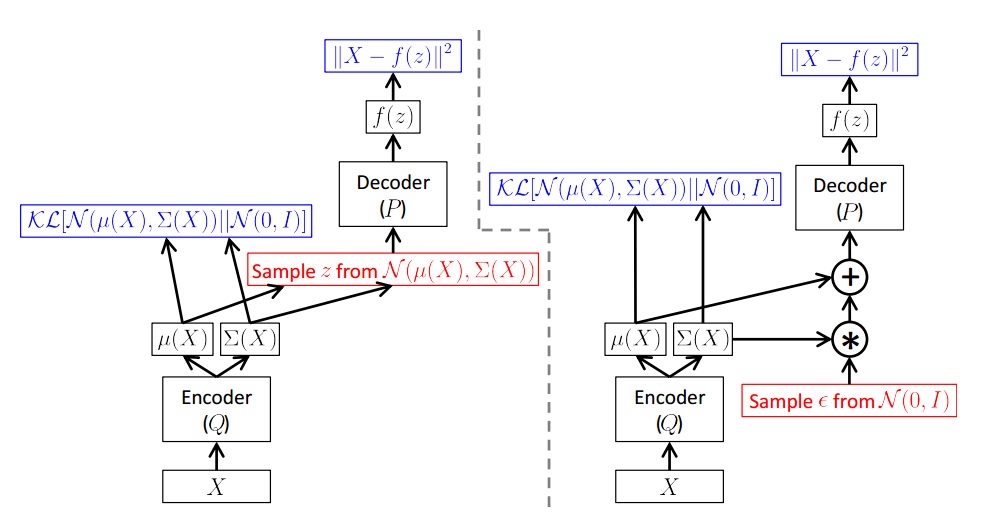
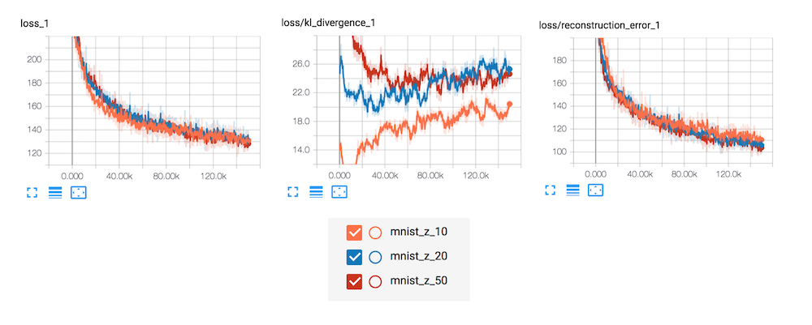
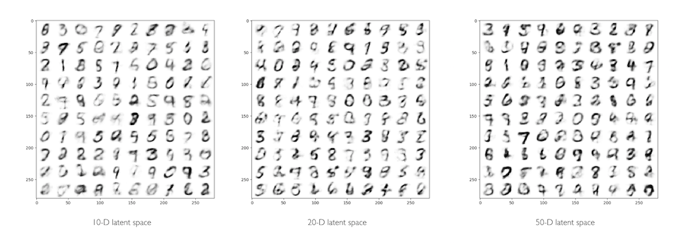

# Variational Autoencoder [](https://github.com/hb-research)

TensorFlow implementation of [Auto-Encoding Variational Bayes](https://arxiv.org/abs/1312.6114).



## Requirements

- Python 3.6
- TensorFlow >= 1.4
- [hb-config](https://github.com/hb-research/hb-config) (Singleton Config)
- requests
- [Slack Incoming Webhook URL](https://my.slack.com/services/new/incoming-webhook/)
- Matplotlib


## Project Structure

init Project by [hb-base](https://github.com/hb-research/hb-base)

    .
    ├── config                  # Config files (.yml, .json) using with hb-config
    ├── data                    # dataset path
    ├── variational_autoencoder     # VAE architecture graphs (from input to logits)
        └── __init__.py             # Graph logic
    ├── data_loader.py          # download data -> generate_batch (using Dataset)
    ├── main.py                 # define experiment_fn
    └── model.py                # define EstimatorSpec

Reference : [hb-config](https://github.com/hb-research/hb-config), [Dataset](https://www.tensorflow.org/api_docs/python/tf/data/Dataset#from_generator), [experiments_fn](https://www.tensorflow.org/api_docs/python/tf/contrib/learn/Experiment), [EstimatorSpec](https://www.tensorflow.org/api_docs/python/tf/estimator/EstimatorSpec)

## Config

Can control all **Experimental environment**.

example: mnist.yml

```yml
model:
  batch_size: 32
  z_dim: 20
  n_output: 784

  encoder_h1: 512
  encoder_h2: 256
  encoder_h3: 128

  decoder_h1: 128
  decoder_h2: 256
  decoder_h3: 512

train:
  learning_rate: 0.00001
  optimizer: 'Adam'                # Adagrad, Adam, Ftrl, Momentum, RMSProp, SGD

  train_steps: 200000
  model_dir: 'logs/mnist'

  save_checkpoints_steps: 1000
  check_hook_n_iter: 1000
  min_eval_frequency: 10

  print_verbose: True
  debug: False

slack:
  webhook_url: ""                   # after training notify you using slack-webhook
```

* debug mode : using [tfdbg](https://www.tensorflow.org/programmers_guide/debugger)


## Usage

Install requirements.

```pip install -r requirements.txt```

Then, start training model

```
python main.py --config mnist
```

After training, generate image from latent vector.

```
python generate.py --config mnist --batch_size 100
```


### Experiments modes

:white_check_mark: : Working  
:white_medium_small_square: : Not tested yet.

- :white_check_mark: `evaluate` : Evaluate on the evaluation data.
- :white_medium_small_square: `extend_train_hooks` :  Extends the hooks for training.
- :white_medium_small_square: `reset_export_strategies` : Resets the export strategies with the new_export_strategies.
- :white_medium_small_square: `run_std_server` : Starts a TensorFlow server and joins the serving thread.
- :white_medium_small_square: `test` : Tests training, evaluating and exporting the estimator for a single step.
- :white_check_mark: `train` : Fit the estimator using the training data.
- :white_check_mark: `train_and_evaluate` : Interleaves training and evaluation.

---


### Tensorboar

```tensorboard --logdir logs```



## Result

- Generate Mnist image (Config: `mnist.yml`)



## Reference
- [hb-research/notes - Auto-Encoding Variational Bayes](https://github.com/hb-research/notes/blob/master/notes/vae.md)
- [Paper - Auto-Encoding Variational Bayes](https://arxiv.org/abs/1609.05473)
- [shaohua0116/VAE-Tensorflow ](https://github.com/shaohua0116/VAE-Tensorflow)

## Author

[Dongjun Lee](https://github.com/DongjunLee) (humanbrain.djlee@gmail.com)
